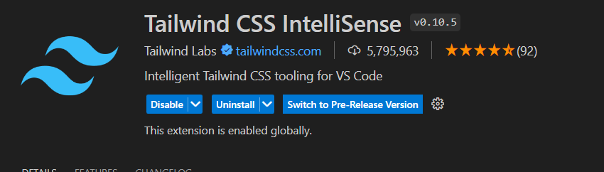

# Start
### 2.설치 및 초기화 
- 터미널 입력
~~~
npx create-next-app@latest
~~~
- page.tsx main안에 다지우기 
- global.css tailwind초기화문 빼고 다 지우기

# Tailwind
- utility-first : tailwind 짧고 작은 이름을 많이 가지고 있다는 뜻
- 
### modifier
- hover:bg-green-600
- hover:scale-125